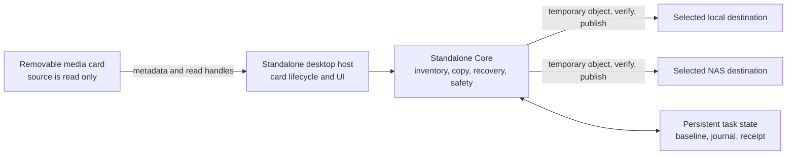
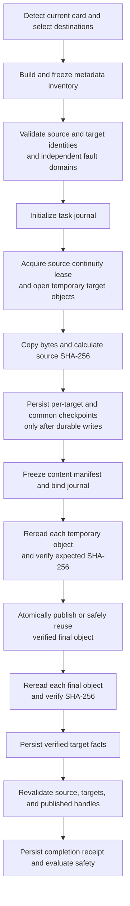
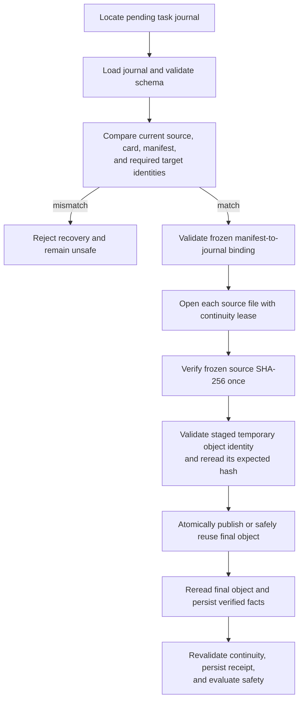

# AutoCardSync Standalone V1 Architecture

## Purpose and scope

AutoCardSync Standalone V1 is a Windows desktop workflow for copying selected media from a removable card to one or two selected destinations. Its safety decision binds the **current card instance** and currently approved inventory to freshly verified source and target objects. Persisted evidence identifies the original backup requirements and objects to check.

This document describes the Standalone product only. It covers the desktop host, the Standalone Core transfer and recovery rules, the removable source card, and the selected local and NAS destinations. It does not describe a remote control plane, a central database, or any external service as part of the safety decision.

The implementation intentionally separates three questions:

1. Which files belong to this card and this selection?
2. Have the selected target copies been durably created and independently verified?
3. Does fresh verification cover every currently approved file and all of its original required copies?

The answer to the third question is fail-closed. A partially complete transfer, missing receipt, changed identity, or unavailable required target is never presented as safe completion.

## System boundary

### Components and responsibilities

| Component | Responsibility | Safety boundary |
| --- | --- | --- |
| Removable card | Supplies source media and identity evidence. | The application opens source files for reading only; it does not write, delete, rename, format, or repair the card. |
| Desktop host | Detects cards, manages the visible lifecycle, starts or resumes a task, and renders the safety decision. | UI state is observational. It does not override the Core safety decision. |
| Standalone Core | Builds manifests, checks source and target continuity, copies data, persists recovery facts, validates completion, and evaluates safety. | A failed check stops the affected transfer rather than inferring success. |
| Local and NAS targets | Hold independently selected copies. | Each required target must complete its own temporary verification, publish step, and final reread. |
| Persistent state | Stores card baseline, task journal, and completion receipt. | State is input to recovery and safety validation, not a substitute for current identity checks. |

`StandaloneTargetMode` determines whether the selected task requires the local target, the NAS target, or both. A target is required only when selected, but every selected target is required for that task's safety decision. When two targets are selected, they must resolve to independent fault domains; a shared volume, alias, nested path, or equivalent destination is rejected before copying starts.

## Card lifecycle and destination mapping

Standalone separates card registration from media transfer:

1. **Recognize:** the mounted card is assigned a card instance and its current source identity is inspected.
2. **Initialize in software:** `card.initialize` establishes an empty import boundary and never formats or writes to the card. Empty selections produce `no_backup_conclusion`; selected media already present on a nonempty card enters the normal transfer and verification flow.
3. **Configure the card profile:** `card.profile.configure` changes only the selected card's source-folder and media-type policy. Global target settings and other card profiles remain intact.
4. **Import incrementally:** a fresh task compares the current inventory with the last successful baseline and includes only new or identity/content-changed media.

For a new task, the target folder is shared between selected local and NAS roots and is named `卡名 M.d-HH：mm`. The journal keeps the source `RelativePath` for identity continuity and auditability, but schema-v3 `DestinationRelativePath` is a validated single file name used by temporary objects, publication, recovery, and final verification. Stable collision suffixes prevent same-name media from overwriting one another. A legacy schema-v2 journal continues to resolve its historical source-relative destination path so upgrading does not move or reinterpret an unfinished task.

## Safety invariants

The following invariants drive `SafeToRemoveCard`:

1. **Source remains read only.** Source handles are opened with read access. The workflow never modifies source-card files.
2. **Inventory and content facts are bound.** A fresh task starts from a frozen metadata inventory. After the source content hashes are read, the content manifest is frozen and bound to the task journal.
3. **Identity continuity is checked.** The source card, source files, target roots, temporary objects, and final published objects are checked for continuity at the relevant stages. Identity changes fail the task or make recovery ineligible.
4. **Selected targets are isolated.** One or two targets are allowed. Their resolved storage identities and fault domains must remain consistent with the selected task.
5. **A checkpoint is common only after durable target work.** During a multi-target copy, a common checkpoint is persisted only after every selected target has durably written the matching bytes and the corresponding journal facts are persisted.
6. **Temporary data is verified before publication.** A temporary object is reread and checked against the source hash before it is atomically published. A pre-existing final object may be reused only when it independently verifies as the expected object; different content is never overwritten as a successful reuse.
7. **Final data is verified after publication.** Each selected final object is reread and checked after publication or verified reuse.
8. **Completion is receipt-backed.** A local completion receipt is persisted only after the task's final facts have been validated. The safety decision requires no failed or pending included file, unchanged source and target identities, and all required receipt and verification conditions.

The safety evaluator is deliberately conservative: a single usable copy is not treated as evidence that a two-target task is safely complete. A previously completed card does not grant safety to a newly inserted card.

## Fresh transfer flow

A fresh transfer starts from the current card and selected destinations. It builds a content manifest while reading the source once for local staging. When both targets are selected, the NAS staging path can relay from the locally staged temporary object whose source-read hash has been bound; this avoids reopening the card once per target while preserving independent target verification.

The transfer coordinator returns a `FreshTransferExecution` that owns the identity and publication leases until the caller writes and validates the receipt. The caller must revalidate continuity at that boundary and dispose the execution afterwards. Progress notifications and I/O metrics are useful observations, but they never establish completion on their own.

## Frozen recovery flow

A transfer may be recoverable after source content hashes and the task journal have been frozen, but before all final objects and the receipt have been completed. Recovery does not guess from filenames, temporary files, or progress percentages. It begins by validating the persisted bindings against the currently inserted card and selected targets.

Recovery is not permitted when the source identity, card instance identifier, target mode, inventory manifest, content manifest, or a required target identity differs from the journal. A recovery rejection preserves the evidence for diagnosis but does not mark the card safe or silently continue from an unrelated card.

## Persistent evidence

Completed-task restoration is asynchronous and serialized with active card work. The receipt and journal are validated as lookup evidence, then each included current source and original required target is opened read-only, checked for object identity and length, and fully hashed. Leases remain alive through the synchronous status publication, with a final continuity check immediately before publication. Cancellation or missing current proof cannot publish a safe completion.

The inventory evidence planner combines matching files from historical tasks belonging to the recognized card. Each task retains its original target mode and roots. Explicit card reassociation changes the current binding; it does not rewrite journal or receipt identities or manufacture verification. Historical verification across the authorized binding still requires current file identity and full content checks.

Status carries `verificationScope`, `taskVerified`, current inventory and verified-file counts, and historical verification validity. `task` scope cannot set whole-card `safeToClear`. Only positive, complete `current-inventory` coverage can do so. Unchanged metadata, empty selections, registration, and reassociation remain observations. Changing destinations does not backfill historical files; an explicit fresh restart is a separate user action.

| Artifact | Purpose | What it must not be used for |
| --- | --- | --- |
| **Inventory Baseline** | Captures the recognized card instance, source identity, selection-policy hash, and known metadata entries. It supports later detection of added, modified, missing, and identity-changed source files. | It is not proof that bytes were copied or that the card may be removed. |
| **Task Journal** | Records one task's source/card/target bindings, file states, temporary and final object facts, checkpoints, frozen manifest state, and receipt-persisted state. It is written atomically and validated on load. | It is not authority to resume if current identities or manifest bindings differ. |
| **Completion Receipt** | Captures final source and target facts for a finished task and is validated with the journal before safety is granted. | It cannot make a card safe when required target verification, identity continuity, or journal facts are missing. |

The journal supports either a legacy single JSON document or a sharded layout. In the sharded layout, task discovery metadata is published after the dependent state files so an incomplete initialization is not mistaken for a complete task journal.

## Failure handling and user-visible meaning

| Condition | Required behavior |
| --- | --- |
| Card removed during work | Stop the task and do not issue safe-removal completion. Reinserted media must pass current identity checks before recovery is considered. |
| Source file metadata, file identity, or content changes | Fail closed. Do not treat a partially copied target as current source content. |
| Local or NAS target disconnects, changes identity, or resolves into the same fault domain | Stop or reject the task. A remaining target does not satisfy a two-target requirement. |
| Temporary object changes or does not match its expected hash | Reject publication and keep the task unsafe. |
| Final path already exists | Reuse is allowed only after independently verifying the expected final object; conflicting data is not overwritten as a successful result. |
| Process interruption after the content manifest is frozen | Offer only the frozen recovery path, which rechecks journal bindings, source hashes, temporary objects, and final objects. |
| Journal or receipt is missing, corrupt, or inconsistent | Reject recovery or completion. The absence of evidence is unsafe, not successful. |
| A different card is inserted | Start from card recognition and its own baseline. Do not display a prior card's completion as the new card's result. |

## Code entry points

| Concern | Primary code entry |
| --- | --- |
| Desktop orchestration, lifecycle, receipt creation, and final safety decision | `src/AutoCardSync.Standalone/Services/StandaloneRuntimeService.cs` |
| Fresh staging, source hashing, temporary verification, publication, and final reread | `src/AutoCardSync.Standalone.Core/Copying/FreshTransferCoordinator.cs` |
| Copy pipeline and common durable checkpoints | `src/AutoCardSync.Standalone.Core/Copying/ChunkedFileCopier.cs` |
| Frozen transfer completion | `src/AutoCardSync.Standalone.Core/Copying/FrozenTransferFinalizer.cs` |
| Atomic publication and verified reuse | `src/AutoCardSync.Standalone.Core/Copying/AtomicFilePublisher.cs` |
| Journal persistence and validation | `src/AutoCardSync.Standalone.Core/Recovery/StandaloneTaskJournalStore.cs` |
| Recovery identity eligibility | `src/AutoCardSync.Standalone.Core/Recovery/StandaloneTaskJournal.cs` |
| Manifest-to-journal binding | `src/AutoCardSync.Standalone.Core/Recovery/ManifestJournalBindingValidator.cs` |
| Baseline and incremental inventory comparison | `src/AutoCardSync.Standalone.Core/Cards/StandaloneInventoryBaselineStore.cs` |
| Completion-receipt validation and final safety rules | `src/AutoCardSync.Standalone.Core/Transfer/StandaloneCompletionReceiptValidator.cs` and `src/AutoCardSync.Standalone.Core/Safety/StandaloneSafetyDecision.cs` |

## Maintenance rules

Changes to transfer or recovery code must preserve the distinction between observation and proof. UI progress, copied-byte counts, and a single target's success are observations. Durable target rereads, identity continuity, journal/manifest binding, and a validated completion receipt are the facts used to make a safety decision.

When a new recovery path is introduced, document its identity prerequisites, its persisted inputs, the point at which it may publish a final object, and the exact conditions required before a completion receipt can be written. If those conditions cannot be proven, the path must remain unsafe and provide a recoverable next action rather than treating the transfer as complete.
